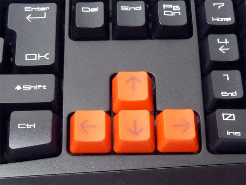

The Sense HAT joystick is mapped to the four keyboard cursor keys, and the joystick's middle-click is mapped to the `Return` key. This means that using the joystick has exactly the same effect as pressing those keys on the keyboard. Remember that the down direction is with the HDMI port facing downwards.

  


- In a Python file, enter the following code:

    ```python
    from sense_hat import SenseHat
    sense = SenseHat()


    while True:
        for event in sense.stick.get_events():
            print(event.direction, event.action)
    ```

This code will print out the direction that the joystick is pushed in, or the direction from which it was released.

<iframe src="https://trinket.io/embed/python/ee4e2a3edf" width="100%" height="600" frameborder="0" marginwidth="0" marginheight="0" allowfullscreen></iframe>

- When you run the program and move the joystick in various directions, you should see something like the following in the terminal window. In the trinket emulator, you can pretend to move the joystick using your keyboard's cursor keys.

```python
('up', 'pressed')
('up', 'released')
('down', 'pressed')
('down', 'released')
('left', 'pressed')
('left', 'released')
('right', 'pressed')
('right', 'released')
('middle', 'pressed')
('middle', 'released')
```


